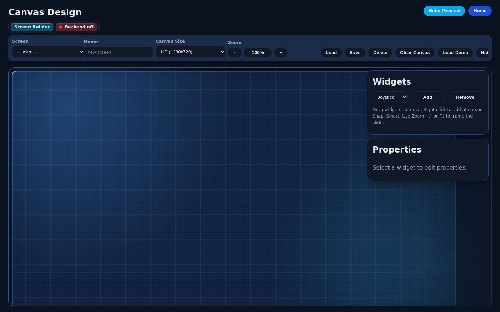
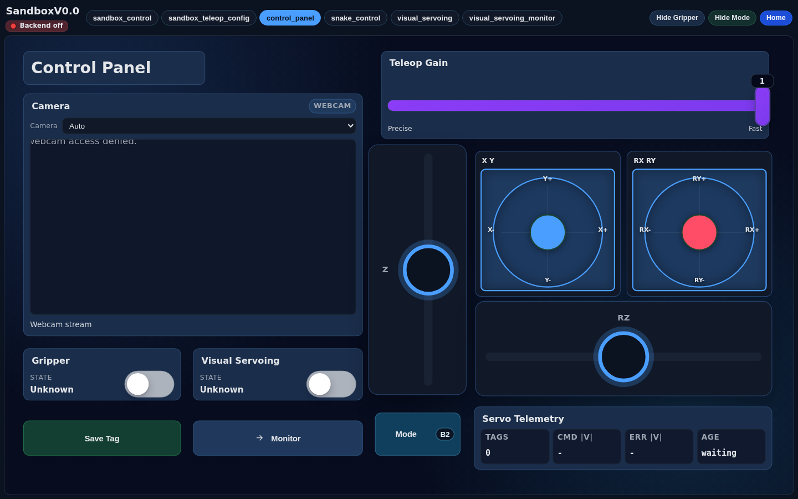
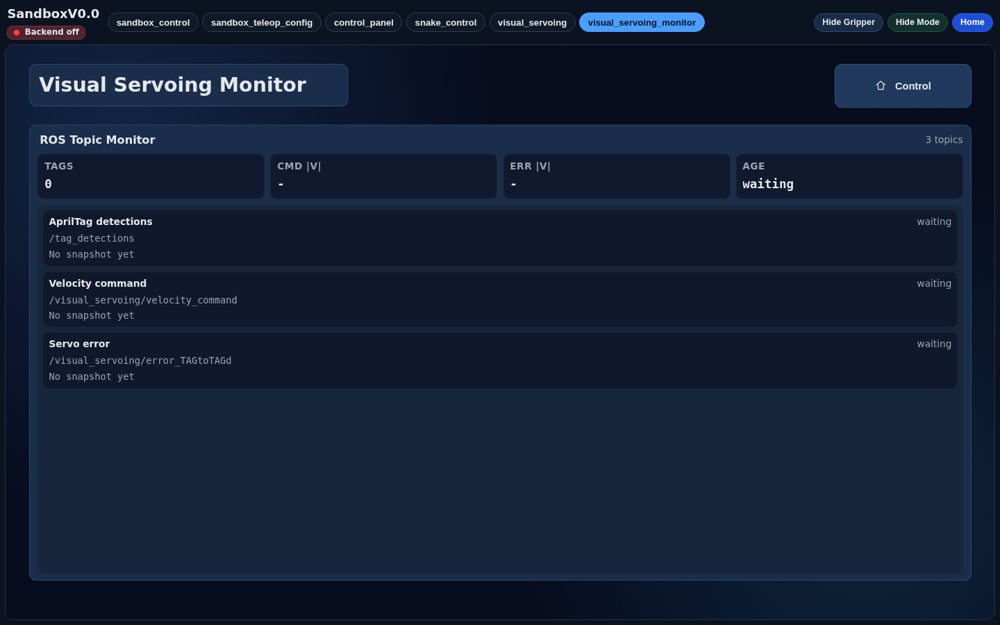

# Extender UI

`extender_ui` is the current React tablet interface for the ISIR Extender robot
stack. It provides configurable operator screens for teleoperation, sandbox
experiments, webcam preview, visual-servoing supervision, snake control, and
legacy app workflows.

The current production-style app for new work is **Sandbox V0.0**. Petanque is
kept as a legacy/example app family and should not be used as the default
template for new development.

<p align="center">
  
  
  
  
</p>

<p align="center">
  <a href="#preview">Preview</a> ·
  <a href="#current-state">Current State</a> ·
  <a href="#sandbox-v00">Sandbox V0.0</a> ·
  <a href="#user-guide">User Guide</a> ·
  <a href="#architecture">Architecture</a> ·
  <a href="#compatibility">Compatibility</a> ·
  <a href="#development">Development</a> ·
  <a href="#bloom-migration">Bloom Migration</a>
</p>

## Preview

| Screen builder | Sandbox control panel | Visual-servoing monitor |
| --- | --- | --- |
|  |  |  |

Refresh these screenshots from a running frontend:

```bash
npm run dev
EXTENDER_UI_URL=http://127.0.0.1:5173 npm run capture:readme
```

## Current State

- Canvas-based screen editor with reusable widgets.
- Runtime application mode for tablet operation.
- Sandbox V0.0 app with teleoperation, snake control, visual servoing, and
  topic monitoring screens.
- Browser webcam preview through stream widgets.
- Generic ROS typed-message widgets for booleans, strings, and custom payloads.
- Topic monitor widgets for small diagnostic ROS messages.
- Legacy Petanque screens kept for compatibility and as migration examples.
- Backend integration through the
  [`tablet_interface`](https://github.com/ISIR-EXTENDER/input_interfaces/tree/main/tablet_interface)
  ROS 2 package.

## Sandbox V0.0

Sandbox V0.0 is the recommended app for new Extender UI and controller
development. It is designed to work with
[`sandbox_controller`](https://github.com/ISIR-EXTENDER/sandbox_controller) and
the `tablet_interface` backend.

Current Sandbox V0.0 screens:

| Screen | Purpose |
| --- | --- |
| `sandbox_control` | General sandbox teleoperation and UI smoke checks. |
| `sandbox_teleop_config` | Teleoperation configuration and reusable widget examples. |
| `control_panel` | Daily operation screen with webcam preview, Cartesian velocity controls, gain, gripper, visual-servoing controls, and compact telemetry. |
| `snake_control` | Two-mode joystick control with B1/B2 mode toggle and hold-to-enable snake command. |
| `visual_servoing` | Camera/RViz preview plus visual-servoing ON/OFF and save-tag controls. |
| `visual_servoing_monitor` | Dedicated topic monitor for AprilTag detections, velocity commands, and servo error snapshots. |

Petanque screens are still useful as examples of app-specific runtime behavior,
but they are a legacy project. New features should start from Sandbox V0.0
unless the work explicitly targets Petanque maintenance.

## User Guide

### Open The App

1. Start the frontend with `npm run dev`.
2. Open the Vite URL, usually `http://127.0.0.1:5173`.
3. Use the home page to open either the screen builder or a runtime app.
4. For new testing, choose **Sandbox V0.0**.

### Use Runtime Screens

Runtime URLs follow this shape:

```text
/application/:appId/:screenId
```

Useful Sandbox V0.0 examples:

```text
/application/application-95a8/control_panel
/application/application-95a8/snake_control
/application/application-95a8/visual_servoing
/application/application-95a8/visual_servoing_monitor
```

The runtime header lets the operator switch between screens included in the
current app. Runtime mode is intentionally operator-focused: widgets can be
used, but they cannot be moved or resized.

### Edit A Screen

1. Open `/canvas-design`.
2. Select an existing configuration or load a TypeScript preset.
3. Add widgets from the catalog.
4. Drag and resize widgets on the canvas.
5. Select a widget to edit its label, topic, message type, colors, and
   type-specific options.
6. Save the configuration.

### Create Or Edit An App

An app is a named set of screens with one home screen.

1. Open the application management controls from the builder.
2. Create a new app or edit an existing one.
3. Add the screens that should be visible in runtime.
4. Pick the `homeScreenId`.
5. Save the app, then open `/application/:appId`.

Use Sandbox V0.0 as the reference app layout when adding new robot workflows.

### Save, Sync To Folder, And Sync From Folder

Screen and app edits are first stored in browser `localStorage`.

- **Save** stores the current screen/app in the browser.
- **Sync To Folder** exports the saved screens/apps as JSON files.
- **Sync From Folder** imports JSON files from disk and merges them into the
  local browser state.

Recommended workflow for shared screens:

1. Edit and save in the builder.
2. Use **Sync To Folder** to export JSON.
3. Review JSON diffs in Git.
4. Remove timestamp-only `updatedAt` noise before committing.
5. Use **Sync From Folder** after pulling team changes to refresh local browser
   state.

### Use Webcam And Video Widgets

Stream widgets can display browser webcam streams. The browser may ask for
camera permission. If webcam access fails, close other browser tabs or ROS
nodes that may already be using the same `/dev/video*` device.

For ROS camera pipelines, use video/stream widgets for image data. Do not use
topic monitor widgets for `sensor_msgs/msg/Image` or
`sensor_msgs/msg/CompressedImage`; topic monitors are for small diagnostic
messages.

### Use Topic Monitor Widgets

Topic monitor widgets subscribe through the backend and display compact topic
snapshots. They support:

- stale thresholds;
- backend subscription failure events;
- compact summary mode;
- optional raw JSON display;
- adding, editing, and removing monitored topics from the editor.

## Architecture

Extender UI is intentionally split between a generic web interface and ROS 2
backend packages.

```text
operator action
  -> React widget/store
  -> websocket message
  -> tablet_interface backend
  -> ROS 2 topic/service
  -> controller or perception node
  -> ROS feedback/topic snapshot
  -> tablet_interface backend
  -> UI state, event, or monitor widget
```

Important repositories:

| Repository | Role |
| --- | --- |
| [`extender_ui`](https://github.com/ISIR-EXTENDER/extender_ui) | React tablet frontend, screen builder, runtime app renderer. |
| [`input_interfaces`](https://github.com/ISIR-EXTENDER/input_interfaces) | ROS 2 input/backend packages, including `tablet_interface`. |
| [`controllers`](https://github.com/ISIR-EXTENDER/controllers) | Shared robot controllers such as Cartesian velocity, joint interpolation, and shared-control controllers. |
| [`sandbox_controller`](https://github.com/ISIR-EXTENDER/sandbox_controller) | Reference sandbox controller for new controller prototypes and UI/backend smoke tests. |
| [`robot_interfaces`](https://github.com/ISIR-EXTENDER/robot_interfaces) | Shared ROS messages such as `extender_msgs/msg/TeleopCommand`. |
| [`tools`](https://github.com/ISIR-EXTENDER/tools) | Tools such as `apriltag_detector`. |
| [`visual_servoing`](https://github.com/ISIR-EXTENDER/visual_servoing) | Visual-servoing control loop used by Robin's workflow. |
| [`bloom`](https://github.com/ISIR-EXTENDER/bloom) | WIP next-generation monorepo that will replace `extender_ui` and its backend flow. |

### Backend Contract

The frontend connects to:

```text
ws://localhost:8765/ws/control
```

`tablet_interface` receives websocket messages such as:

- `teleop_cmd`
- `ui_button`
- `ui_scalar`
- `ui_typed`
- `topic_subscribe`
- `camera_frame`

The backend publishes ROS messages, manages topic subscriptions, and sends
state/events back to the UI.

### Teleoperation Contract

Joystick, slider, and mode widgets do not publish directly to their widget
`topic` fields during normal teleoperation. They update the teleop store, and
the frontend sends:

```text
type: teleop_cmd
mode: number
linear: {x, y, z}
angular: {x, y, z}
```

`tablet_interface` republishes this command as:

| ROS topic | Message |
| --- | --- |
| `/teleop_cmd` | `extender_msgs/msg/TeleopCommand` |

Widget `topic` values such as `/cmd/joystick`, `/cmd/joystick_z`, or
`/cmd/mode` are UI configuration metadata for the screen editor and readouts.
Changing them does not change the backend ROS teleop topic.

Generic teleoperation treats `/cmd/max_velocity` as a normalized gain from `0`
to `1`. Legacy Petanque throw controls keep their own app-specific ranges on
dedicated topics.

### Typed ROS Message Widgets

Some widgets publish directly to configured ROS topics through the generic
typed-message bridge:

- `ROS Message Toggle`: publishes one typed payload for ON and one for OFF.
- `Momentary ROS Message`: publishes one typed payload while pressed and
  another when released.

At runtime these widgets send `ui_typed` websocket messages.
`tablet_interface` republishes the configured ROS message type and payload.

### Snake Control Contract

The `snake_control` screen uses two independent flows:

| UI control | Backend path | ROS effect |
| --- | --- | --- |
| 2D joystick | `teleop_cmd` websocket message | Publishes `/teleop_cmd` |
| Green mode button | teleop mode store | `B1 -> mode: 0`, `B2 -> mode: 3` |
| Orange hold button | `ui_typed` websocket message | Publishes `/activate_snake` as `std_msgs/msg/Bool` |

The frontend sends the same joystick velocity in `B1` and `B2`. Only the mode
field changes; the controller interprets the mode backend-side.

Momentary snake button contract:

```text
press   -> /activate_snake std_msgs/msg/Bool {data: true}
release -> /activate_snake std_msgs/msg/Bool {data: false}
```

### Visual Servoing Contract

Current visual-servoing topics:

| Topic | Message | Direction |
| --- | --- | --- |
| `/ui/visual_servoing/on` | `std_msgs/msg/Bool` | UI -> ROS |
| `/ui/visual_servoing/save` | `std_msgs/msg/String` | UI -> ROS |
| `/tag_detections` | `extender_msgs/msg/SharedControlGoalArray` | AprilTag detector -> UI / visual servoing |
| `/visual_servoing/velocity_command` | `geometry_msgs/msg/TwistStamped` | visual servoing -> UI |
| `/visual_servoing/error_TAGtoTAGd` | `geometry_msgs/msg/TwistStamped` | visual servoing -> UI |

For the ROS AprilTag pipeline, camera images usually come from:

```text
/image_raw
/camera_info
```

The AprilTag detector then publishes:

```text
/tag_detections
```

## Compatibility

This table documents the local commits used while validating the current
Extender UI README and Sandbox V0.0 integration notes.

| Component | Repository | Branch checked | Commit checked | Notes |
| --- | --- | --- | --- | --- |
| Frontend | [`extender_ui`](https://github.com/ISIR-EXTENDER/extender_ui) | Current branch | This README update | Documents the current Sandbox V0.0 UI contract. |
| Workspace wrapper | [`extender_workspace`](https://github.com/ISIR-EXTENDER/extender_workspace) | `main` | `da55bc9 fix: import sandbox controller repository (#4)` | Imports `sandbox_controller` as a standalone repository. |
| Controllers | [`controllers`](https://github.com/ISIR-EXTENDER/controllers) | `main` | `99fcbdb Add snake demo controller; previous: c6bbebc feat: add snake mode to cartesian_velocity controller (#7)` | Shared robot controllers. |
| Sandbox controller | [`sandbox_controller`](https://github.com/ISIR-EXTENDER/sandbox_controller) | `main` | `0411619 fix: use synced joint positions for feedback (#4)` | Reference controller for new UI/backend/controller smoke tests. |
| Backend/input interfaces | [`input_interfaces`](https://github.com/ISIR-EXTENDER/input_interfaces) | `main` | `b278a53 Add snake Demo; previous: c72c02a docs: update tablet interface readme (#20)` | Provides `tablet_interface`. |
| Robot messages | [`robot_interfaces`](https://github.com/ISIR-EXTENDER/robot_interfaces) | `main` | `1543180 Merge pull request #5 from ssrpo/fix/remove-stale-joint-pose-helper` | Provides shared ROS messages. |
| Tools | [`tools`](https://github.com/ISIR-EXTENDER/tools) | `main` | `800bed7 Merge pull request #4 from MegMll/topic/add_snake` | Provides `apriltag_detector` for visual-servoing tag telemetry. |
| Input devices | [`explorer_stack`](https://github.com/ISIR-EXTENDER/explorer_stack) | `feat/petanque` | `bee7467 feat - petanque parameter` | Current input-device package is `explorer_input_devices`; no top-level `input_devices` repo exists in this workspace. |
| Visual servoing | [`visual_servoing`](https://github.com/ISIR-EXTENDER/visual_servoing) | `main` | `bc6a33a first commit` | Robin's visual-servoing package cloned locally for integration checks. |
| Next platform | [`bloom`](https://github.com/ISIR-EXTENDER/bloom) | WIP | `5db90c9 fix(ros): add topic status preflight diagnostics (#95)` | Future replacement platform; see [Bloom Migration](#bloom-migration). |

## Repository Layout

```text
src/app/                  application registry, routing, runtime orchestration
src/app/runtime/          generic runtime/plugin system
src/apps/                 app-specific behavior
src/components/widgets/   widget models, renderers, catalog, and migrations
src/components/teleop/    joystick UI and teleoperation controls
src/pages/                editor/runtime pages
src/services/             websocket client
src/store/                UI and teleop state stores
data/                     default screen/application JSON files
docs/                     architecture, contribution notes, README screenshots
```

## Required Extender Packages

For frontend-only development, only Node.js and npm are required.

For a working robot/sandbox setup, `extender_ui` expects these Extender packages
to exist in the ROS 2 workspace:

| Package / repo | Required for | Notes |
| --- | --- | --- |
| `input_interfaces/tablet_interface` | Required runtime backend | Websocket server used by the UI. Bridges UI messages to ROS and sends state/events back. |
| `robot_interfaces/extender_msgs` | Required by backend/controller contracts | Provides `extender_msgs/msg/TeleopCommand` and shared-control messages used by the stack. |
| `sandbox_controller` | Sandbox teleop and feedback | Consumes `/teleop_cmd` and publishes sandbox feedback used by the UI. |
| `tools/apriltag_detector` | Visual-servoing tag telemetry | Publishes `/tag_detections` for visual servoing and monitoring. |
| `visual_servoing` | Visual-servoing control loop | Consumes `/tag_detections`, `/ui/visual_servoing/on`, and `/ui/visual_servoing/save`; publishes command/error telemetry. |

Optional or legacy packages:

- Petanque controllers/state-machine packages for legacy Petanque screens.
- `usb_cam` (`ros-humble-usb-cam`) when running the AprilTag camera pipeline
  through ROS image topics.

## Development

### Prerequisites

- Node.js 20 or newer.
- npm.
- ROS 2 Humble for backend integration.
- A built Extender ROS workspace when using the UI with live ROS topics.

### Install

```bash
cd extender_frontend/extender_ui
npm install
```

### Run The Frontend

```bash
npm run dev
```

Vite prints the local URL, usually:

```text
http://localhost:5173
```

The frontend can be opened without the backend, but live robot state and ROS
publication require `tablet_interface`.

### Run With The Backend

From the ROS workspace:

```bash
source /opt/ros/humble/setup.bash
source install/setup.bash
ros2 run tablet_interface tablet_interface_node
```

### Useful Commands

```bash
npm run dev          # start Vite
npm run build        # typecheck and build
npm run lint         # eslint
npm test -- --run    # unit tests
npm run test:e2e     # Playwright tests
npm run capture:readme
```

The current lint configuration may report existing React hook/compiler warnings.
Treat new errors as blocking.

## Working With Screen Data

Default screens are stored in `data/*.json` and mirrored by configuration
factories/migrations in `src/components/widgets/configurations.ts`.

When changing a default screen:

1. Keep JSON diffs intentional.
2. Avoid timestamp-only `updatedAt` changes.
3. Update migrations when an existing localStorage screen should receive the
   new widget or setting.
4. Do not write migrations that permanently override future manual edits from
   the screen editor.

## Bloom Migration

[`Bloom`](https://github.com/ISIR-EXTENDER/bloom) is the WIP next-generation
robot UI platform. It is being developed as a monorepo that combines the
frontend, backend API, reusable widget contracts, runtime safety rules, storage,
and ROS adapters.

The goal is for Bloom to replace both `extender_ui` and the current dedicated
backend flow once the team has validated equivalent robot workflows. Until then,
`extender_ui` and `tablet_interface` remain the stable path for integration
week and current Sandbox V0.0 work.

Migration rule of thumb:

1. Keep shipping stable Extender work in `extender_ui` + `tablet_interface`.
2. Use Sandbox V0.0 as the reference for new Extender workflows.
3. Port accepted workflows into Bloom incrementally.
4. Replace legacy repos only after the matching Bloom workflow is tested with
   the robot stack and accepted by the team.

## Contributing

- Write README content, comments, PR descriptions, and shared docs in English.
- Prefer generic websocket messages over app-specific transport.
- Keep app-specific behavior in `src/apps/<app_name>`.
- Keep the runtime/page layer generic unless behavior truly applies to every
  app.
- Keep video transport separate from topic monitoring.
- Document any new ROS topic contract in both the frontend README and the
  relevant backend package.

## License

This package is part of the ISIR Extender project. See the repository or
workspace-level license information for terms.
